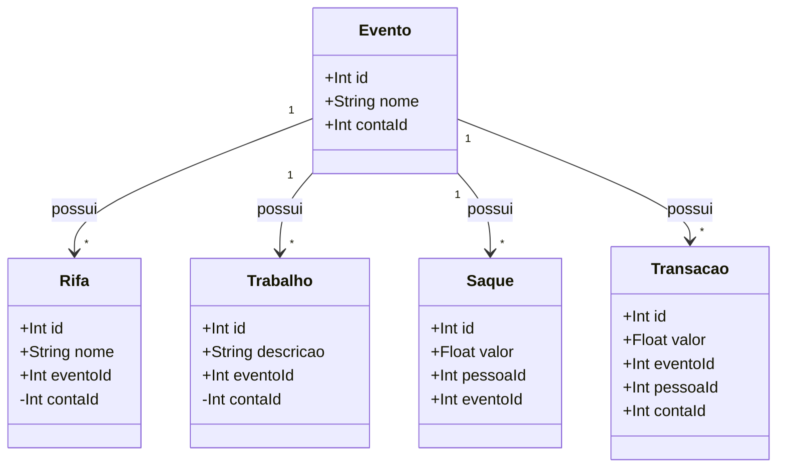
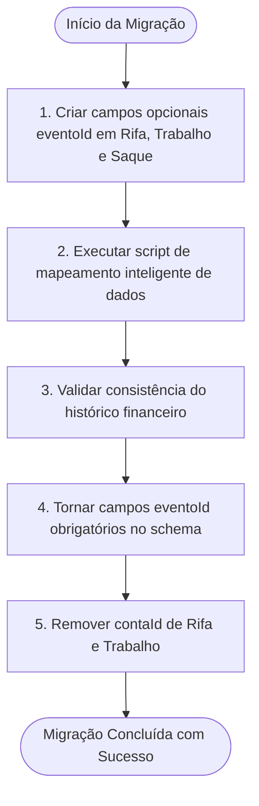

# Plano de Refatoração, Adequação de Negócio e Migração: Centralização em Eventos

Este plano estabelece as diretrizes de negócio, alterações arquiteturais, plano de migração de dados e análise de impacto para transformar o ecossistema GF em um sistema **100% centrado em Eventos**. 

---

## 🎯 Objetivo do Negócio

Atualmente, algumas informações de **Rifas**, **Trabalhos** e **Saques** estão desacopladas do conceito de **Evento**. A proposta é alinhar a arquitetura física e lógica com a realidade operacional: **todo o ecossistema financeiro e operacional gira em torno de eventos**.

### Principais Regras da Nova Modelagem:
1. **Vínculo Obrigatório**: Rifas e Trabalhos passam a ser obrigatoriamente vinculados a um **Evento** (`eventoId`).
2. **Herança de Conta**: Rifas e Trabalhos deixam de ter um campo `contaId` direto. Eles passam a herdar a **Conta Bancária** do Evento associado (`evento.contaId`).
3. **Trava de Inscrição**: 
   - Apenas pessoas devidamente **inscritas** no Evento (`Inscricao`) poderão ser alocadas em Rifas (`AlocacaoRifa`).
   - Apenas pessoas **inscritas** no Evento poderão ser escaladas para trabalhar (`MembroTrabalho` em trabalhos de grupo ou `pessoaId` em trabalhos individuais).
4. **Saldo por Evento**:
   - O saldo de um participante deixa de ser global. A pessoa passará a ter um **Saldo por Evento**.
   - Consequentemente, cada **Saque (Retirada)** deve ser vinculado obrigatoriamente a um **Evento** (`eventoId`). O valor sacado é debitado do saldo específico daquela pessoa naquele evento.

---

## ⚠️ Análise de Impacto (Impact Analysis)

### 1. Roteamento Financeiro e Contas
- **Impacto**: Remoção de `contaId` direto em `Rifa` e `Trabalho`.
- **Análise**: 
  - Nos fluxos de **Rateio de Rifa** e **Rateio de Trabalho**, as transações de repasse que antes usavam `rifa.contaId` ou `trabalho.contaId` agora farão a busca relacional: `rifa.evento.contaId` ou `trabalho.evento.contaId`.
  - **Ajuste no Backend**: As queries do Prisma no `RifasService` e `TrabalhosService` precisarão dar um `include: { evento: true }` para obter a conta de destino.
  - **Ajuste no Frontend**: Nos formulários de cadastro e edição de Rifas e Trabalhos, o campo de seleção de "Conta Financeira" será substituído pelo seletor de "Evento".

### 2. Restrição de Alocação e Escala (Trava de Segurança)
- **Impacto**: Regra que impede alocação de não inscritos.
- **Análise**:
  - **Rifas**: O endpoint de alocar cartela (`/rifas/alocar`) validará se a pessoa tem registro ativo na tabela `inscricoes` para o `eventoId` da Rifa.
  - **Trabalhos**: O cadastro de trabalhos individuais e a inclusão de membros em trabalhos de grupo validarão se os envolvidos estão na tabela `inscricoes` para o `eventoId` do Trabalho.
  - **Impacto na Experiência do Usuário**: No frontend, os dropdowns de seleção de pessoas nesses formulários serão filtrados dinamicamente para mostrar **apenas os participantes inscritos no evento selecionado**, evitando erros de digitação e violações de regras.

### 3. Nova Estrutura de Saques e Saldo por Evento
- **Impacto**: O modelo de saque passa a requerer `eventoId`. O cálculo de saldo torna-se restrito por evento.
- **Análise**:
  - **Fórmula do Saldo por Evento**:
    $$\text{Saldo}_{\text{Pessoa}, \text{Evento } X} = \sum (\text{Receitas}_{\text{Pessoa}, \text{Evento } X}) - \sum (\text{Saques}_{\text{Pessoa}, \text{Evento } X})$$
  - As receitas da pessoa vêm de:
    - Comissão de Rifa (a transação de comissão do vendedor receberá o `eventoId` da Rifa).
    - Repasse de Trabalho Individual/Grupo (a transação de repasse receberá o `eventoId` do Trabalho).
  - Os saques agora exigirão o vínculo com o `eventoId`.
  - **Validação de Saldo no Saque**: O backend no `SaquesService.criar` deverá calcular o saldo atual do participante **especificamente para o evento informado** e rejeitar o saque se o valor solicitado for maior do que o saldo acumulado naquele evento.
  - **Ajuste no Perfil do Participante**: O painel do usuário (`meu-painel`) e a tela de detalhes de pessoas exibirão o saldo detalhado por evento, permitindo transparência total.

---

## 🛠️ Alterações Propostas



### 1. Modelo de Dados (`api/prisma/schema.prisma`)

Necessitamos aplicar as seguintes modificações estruturais:

#### [MODIFY] [schema.prisma](file:///c:/Projetos/GF/api/prisma/schema.prisma)

- **Rifa**: Adicionar relação obrigatória com `Evento` e remover campo `contaId`.
- **Trabalho**: Adicionar relação obrigatória com `Evento` e remover campo `contaId`.
- **Saque**: Adicionar relação obrigatória com `Evento`.

```prisma
model Rifa {
  id              Int            @id @default(autoincrement())
  nome            String
  ...
  eventoId        Int
  evento          Evento         @relation(fields: [eventoId], references: [id])
  // contaId é removido
  ...
}

model Trabalho {
  id             Int              @id @default(autoincrement())
  descricao      String
  ...
  eventoId       Int
  evento         Evento           @relation(fields: [eventoId], references: [id])
  // contaId é removido
  ...
}

model Saque {
  id           Int      @id @default(autoincrement())
  valor        Float
  descricao    String
  data         DateTime @default(now())
  
  pessoaId     Int
  pessoa       Pessoa   @relation(fields: [pessoaId], references: [id], onDelete: Cascade)
  
  eventoId     Int
  evento       Evento   @relation(fields: [eventoId], references: [id], onDelete: Cascade)

  criadoEm     DateTime @default(now())
  atualizadoEm DateTime @updatedAt

  @@map("saques")
}
```

---

### 2. Backend (API NestJS)

#### [MODIFY] [rifas.service.ts](file:///c:/Projetos/GF/api/src/rifas/rifas.service.ts)
- **Criação/Edição**: Aceitar `eventoId` e remover lógica de `contaId`.
- **Alocação de Cartela**: Adicionar verificação se a pessoa está inscrita no evento associado à Rifa:
  ```typescript
  const inscrito = await tx.inscricao.findUnique({
    where: { pessoaId_eventoId: { pessoaId, eventoId: rifa.eventoId } }
  });
  if (!inscrito) {
    throw new BadRequestException('Apenas pessoas inscritas no evento desta rifa podem ser alocadas.');
  }
  ```
- **Rateio**: Buscar a conta bancária do Evento correspondente (`rifa.evento.contaId`) para registrar as transações. Adicionar `eventoId: rifa.eventoId` em ambas as transações geradas no rateio.

#### [MODIFY] [trabalhos.service.ts](file:///c:/Projetos/GF/api/src/trabalhos/trabalhos.service.ts)
- **Criação/Edição**: Aceitar `eventoId` e validar se os membros associados estão inscritos no evento correspondente.
- **Rateio**: Buscar `trabalho.evento.contaId` para lançar despesas de reembolso ou repasses da comunidade. Adicionar `eventoId: trabalho.eventoId` a todas as transações geradas (sejam de repasse individual, repasse de grupo ou comunidade).

#### [MODIFY] [saques.service.ts](file:///c:/Projetos/GF/api/src/saques/saques.service.ts)
- **Criação**: Receber `eventoId` no `CreateSaqueDto`. Calcular o saldo da pessoa especificamente para este evento e garantir que o saldo seja suficiente:
  ```typescript
  const saldoEvento = await this.pessoasService.calcularSaldoPorEvento(pessoaId, eventoId);
  if (saldoEvento < valor) {
    throw new BadRequestException(`Saldo insuficiente no evento selecionado. Saldo disponível: R$ ${saldoEvento.toFixed(2)}`);
  }
  ```

#### [MODIFY] [pessoas.service.ts](file:///c:/Projetos/GF/api/src/pessoas/pessoas.service.ts)
- Adicionar o método `calcularSaldoPorEvento(pessoaId, eventoId)` para calcular o saldo de forma granular baseando-se nas transações e saques filtrados por `eventoId`.
- Adaptar o retorno dos perfis e listagens de pessoas para retornar um objeto com a lista de saldos por evento (`saldos: { eventoId: number, nomeEvento: string, saldo: number }[]`) e o saldo total consolidado.

---

### 3. Frontend (Aplicação Next.js)

#### [MODIFY] Páginas do Dashboard (`web/src/app/(dashboard)/...`)
- **Tela de Rifas** (`rifas/page.tsx`): 
  - Ajustar o formulário de cadastro de Rifa para solicitar a seleção de um "Evento" em vez de uma "Conta".
  - Ajustar a modal de alocação de números para filtrar e mostrar somente as pessoas que estão na lista de inscritos do evento daquela Rifa.
- **Tela de Trabalhos** (`trabalhos/page.tsx`): 
  - Ajustar o formulário de cadastro de Trabalho para solicitar "Evento" em vez de "Conta".
  - Filtrar o seletor de Membros (Grupo) ou Trabalhador (Individual) para mostrar somente inscritos no evento do trabalho.
- **Tela de Pessoas** (`pessoas/page.tsx`): 
  - Modificar o formulário de **Lançamento de Saque Rápido**: adicionar um dropdown para selecionar de qual **Evento** o participante está sacando (filtrando pelos eventos nos quais ele possui saldo ou participação).
  - No histórico financeiro de detalhes do participante, agrupar o extrato e os saldos por Evento.

---

## 🗄️ Plano de Migração de Dados

Para evitar perda de consistência em bancos de dados já populados, a migração será executada através de um script TypeScript customizado (`api/prisma/migration-script.ts`) antes de tornar os novos campos obrigatórios e remover os antigos.

### Passos da Migração:



#### Passo 1: Preparar o Banco
Alterar o `schema.prisma` temporariamente, adicionando `eventoId` como **opcional** (`Int?`) em `Rifa`, `Trabalho` e `Saque`. Executar a migração para criar as colunas.

#### Passo 2: Executar Script de Migração Inteligente (`api/migrate-eventos.ts`)
O script varrerá os dados legados aplicando as seguintes regras de correspondência:

1. **Rifas e Trabalhos Sem Evento**:
   - Para cada Rifa/Trabalho, identificaremos qual `contaId` está vinculada a ela.
   - Buscaremos um Evento ativo que utilize a mesma `contaId`.
   - Caso não exista um Evento para aquela `Conta`, criaremos um Evento fictício/placeholder (Ex: *"Evento Consolidado - [Nome do Caixa]"*) associado à paróquia correta e com a mesma `Conta`.
   - Vincularemos a Rifa ou Trabalho a este Evento.

2. **Inscrições Automáticas Retroativas**:
   - Como agora apenas inscritos podem participar de Rifas ou Trabalhos, o script varrerá todas as alocações de Rifas (`AlocacaoRifa`) e escalas de Trabalhos (`MembroTrabalho`/`Trabalho.pessoaId`) existentes.
   - Para cada participante encontrado, se ele não possuir uma inscrição ativa na tabela `Inscricao` para o evento correspondente, o script **gerará automaticamente a inscrição com status CONFIRMADO** para garantir conformidade imediata com a nova trava relacional.

3. **Migração de Saques**:
   - Para cada `Saque` legado (que hoje não possui eventoId):
     - Identificaremos o participante (`pessoaId`).
     - Verificaremos as inscrições dele em eventos que possuem movimentação.
     - Se o participante possuir apenas uma inscrição, vincularemos o saque a esse Evento.
     - Se possuir mais de uma ou nenhuma, associaremos a um Evento geral correspondente à paróquia dele ou ao evento com maior receita proporcional gerada por ele, garantindo a integridade dos saldos por evento.

4. **Vínculo das Transações Existentes**:
   - Atualizaremos todas as transações financeiras legadas de comissão de Rifa e repasse de Trabalho para preencher o campo `eventoId` retroativamente, permitindo que a reconstrução do Saldo por Evento funcione perfeitamente desde o primeiro dia.

#### Passo 3: Finalizar Schema
Após rodar o script com sucesso, alteraremos as colunas no `schema.prisma` para **obrigatórias** e removeremos definitivamente o campo `contaId` de `Rifa` e `Trabalho`. Aplicaremos o passo final de migração.

---

## 📈 Plano de Verificação e Testes

### 1. Testes de Migração
- Executar o script em ambiente de homologação/cópia de produção e verificar se:
  - Nenhuma Rifa, Trabalho ou Saque ficou sem `eventoId`.
  - As inscrições implícitas foram criadas perfeitamente para participantes com alocações legadas.
  - O cálculo do saldo total histórico do participante antes e depois da migração (soma dos saldos por evento) é exatamente idêntico.

### 2. Testes de Integração de API
Atualizaremos e rodaremos os scripts de verificação para as novas regras de negócio:
- `test-rifa-rateio.ts`: Validar se o rateio da Rifa agora deposita na conta do Evento associado e vincula o `eventoId` nas transações.
- `test-trabalhos-rateio.ts`: Validar se o rateio de trabalhos (individuais e em grupo) deposita na conta correta e com os novos vínculos.
- `test-saques-saldo.ts`: Validar se o saque agora é efetuado por evento, valida o limite por evento e atualiza o respectivo saldo individual daquele evento.

---

> [!IMPORTANT]
> **Decisão Crítica**: O saldo de um participante agora será estritamente setorializado por evento. Se o participante possuir saldo credor no "Evento A" e saldo devedor no "Evento B", ele não poderá efetuar um saque do "Evento B" usando fundos do "Evento A". Os eventos serão tratados financeiramente como entidades isoladas.

> [!NOTE]
> Esta refatoração simplifica drasticamente o modelo relacional de contas. A conta do evento passa a ser a única fonte da verdade financeira da paróquia para as suas campanhas de arrecadação.

---

## 💬 Aguardando seu Feedback

Por favor, analise a consistência lógica deste plano de refatoração, a modelagem dos dados e as regras de negócio de rateios e travas de alocação. 

Assim que der o seu **DE ACORDO**, criaremos a checklist detalhada de tarefas no `task.md` e iniciaremos a execução passo a passo em segurança!
