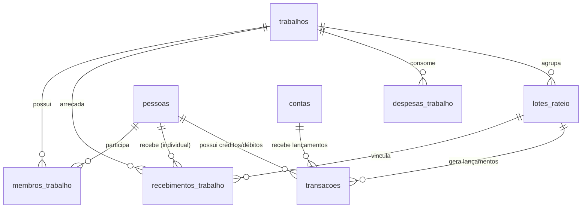

# Relatório de Auditoria e Testes de Integração: Trabalhos e Rateios de Recebimento

Este relatório detalha a auditoria estrutural e os resultados da **Skill de Teste de Integração** executada para o subsistema de **Trabalhos (Individual e Grupo)**, **Recebimentos** e **Rateios Financeiros** no ecossistema da aplicação GF. O objetivo desta análise é certificar a exatidão matemática das distribuições de receitas, o abatimento proporcional de despesas e a consistência relacional do modelo físico no banco de dados PostgreSQL.

---

## 🛠️ O que foi Auditado e Testado

A estrutura do subsistema de **Trabalhos** foi projetada para lidar com a cooperação de membros em serviços e o repasse transparente de valores arrecadados, atendendo a duas regras fundamentais:

1. **Trabalhos Individuais**:
   * O rateio de receitas pode ser **proporcional**, definido pela coluna `proporcao` (de 0% a 100%) associada ao trabalho.
   * O trabalhador que realizou a tarefa individual (`pessoaId` associada ao recebimento) recebe sua cota-parte: `valor * (proporcao / 100)`.
   * A comunidade paroquial recebe o saldo remanescente diretamente em sua conta bancária (`contaId`), agrupado pelo método de pagamento correspondente.
   * As despesas para trabalhos individuais são consideradas nulas no fluxo de rateio.

2. **Trabalhos em Grupo**:
   * O rateio é **sempre de 100%** do valor líquido arrecadado, dividido igualmente entre todos os membros cadastrados na tabela de associação (`membros_trabalho`).
   * As despesas operacionais registradas (`despesas_trabalho`) para o desempenho do trabalho são integralmente deduzidas do montante bruto arrecadado antes de efetuar a distribuição aos membros.
   * O valor correspondente às despesas é devolvido à conta da paróquia como um lançamento de **Reembolso de Despesas**, repondo o caixa que financiou os custos.
   * O valor líquido residual é fracionado e repassado em frações idênticas aos trabalhadores participantes do grupo.

---

## 📐 Modelo Físico Relacional & Mapeamento de Tabelas

Abaixo está o mapeamento lógico das tabelas envolvidas nas operações financeiras e de rateio do subsistema de trabalhos:



### Tabelas Principais Auditadas:
* **`trabalhos`**: Registra o cabeçalho do serviço, definindo se é `INDIVIDUAL` ou `GRUPO`, a proporção de rateio (`proporcao`) e a conta bancária padrão (`contaId`) para repasses comunitários.
* **`membros_trabalho`**: Tabela de associação (N:M) que armazena os membros participantes de um trabalho coletivo.
* **`recebimentos_trabalho`**: Armazena as entradas financeiras brutas dos serviços prestados. Possui colunas cruciais como `status` (deve ser `PAGO` para ser rateado), `metodo` (PIX, Dinheiro, etc.), `pessoaId` (para identificar o executor do trabalho individual) e `loteRateioId` (link para o lote em que foi processado).
* **`despesas_trabalho`**: Registra os custos operacionais (combustível, materiais) desembolsados para a realização do trabalho.
* **`lotes_rateio`**: Histórico atômico contendo os totais de arrecadação bruta, deduções de despesa e valor líquido distribuído por lote de processamento.
* **`transacoes`**: Registro final de auditoria de caixa e contas pessoais (créditos e débitos).

---

## 🧪 Resultados dos Testes de Integração

Desenvolvemos e executamos uma suíte completa de testes de integração acoplada ao NestJS e Prisma (`api/test-trabalhos-rateio.ts`). A execução simulou com fidelidade absoluta as operações reais, auditando os seguintes cenários:

### 1. Cenário 1: Trabalho Individual com Repasses Proporcionais (70% Trabalhador / 30% Paróquia)
* **Configuração de Entrada**:
  * Criação de Trabalho Individual com proporção de repasse de `70%`.
  * Registro de Recebimento 1 (Trabalhador 1): R$ 100,00 via PIX (Status `PAGO`).
  * Registro de Recebimento 2 (Trabalhador 2): R$ 200,00 via Dinheiro (Status `PAGO`).
* **Processamento**:
  * Execução do rateio pelo serviço de trabalhos.
* **Asserções e Validações Matemáticas**:
  * Arrecadação Bruta Total: **R$ 300,00** (Esperado: R$ 300,00 | Obtido: R$ 300,00) — **PASSED**
  * Despesas Abatidas: **R$ 0,00** (Esperado: R$ 0,00 | Obtido: R$ 0,00) — **PASSED**
  * Repasse Trabalhador 1 (70% de R$ 100): **R$ 70,00** em transação de `RECEITA` — **PASSED**
  * Repasse Trabalhador 2 (70% de R$ 200): **R$ 140,00** em transação de `RECEITA` — **PASSED**
  * Share Comunidade PIX (30% de R$ 100): **R$ 30,00** creditado na conta paroquial — **PASSED**
  * Share Comunidade Dinheiro (30% de R$ 200): **R$ 60,00** creditado na conta paroquial — **PASSED**
  * Vinculação dos Recebimentos ao Lote: Todos os recebimentos receberam o ID do lote de rateio gerado — **PASSED**

---

### 2. Cenário 2: Trabalho em Grupo (100% Repasse) com Abatimento de Despesas
* **Configuração de Entrada**:
  * Criação de Trabalho em Grupo com 3 membros participantes.
  * Registro de despesa operacional: R$ 50,00 (Combustível/Alimentação).
  * Registro de Recebimento: R$ 200,00 via PIX (Status `PAGO`).
* **Processamento**:
  * Execução do rateio pelo serviço de trabalhos.
* **Asserções e Validações Matemáticas**:
  * Arrecadação Bruta Total: **R$ 200,00** — **PASSED**
  * Despesas Abatidas: **R$ 50,00** (devolvidos à conta da paróquia como reembolso de despesas) — **PASSED**
  * Valor Líquido Residual: **R$ 150,00** (Arrecadado R$ 200 - Despesa R$ 50) — **PASSED**
  * Repasse Membro 1 (1/3 de R$ 150): **R$ 50,00** em transação de `RECEITA` — **PASSED**
  * Repasse Membro 2 (1/3 de R$ 150): **R$ 50,00** em transação de `RECEITA` — **PASSED**
  * Repasse Membro 3 (1/3 de R$ 150): **R$ 50,00** em transação de `RECEITA` — **PASSED**

---

### 3. Cenário 3: Exceções e Regras de Segurança (Edge Cases)
* **Rateio Vazio**:
  * Tentativa de executar rateio em trabalho que não possui recebimentos com status `PAGO` e sem lote atribuído.
  * *Resultado*: O sistema lançou com sucesso a exceção `BadRequestException("Nenhum recebimento PAGO aguardando rateio.")` — **PASSED**
* **Despesas Maiores que Arrecadação**:
  * Tentativa de executar rateio em trabalho em grupo onde as despesas operacionais acumuladas (R$ 100,00) superavam os lançamentos de recebimento bruto (R$ 20,00).
  * *Resultado*: O sistema barrou a operação lançando `BadRequestException("O valor das despesas pendentes (...) é maior do que o valor arrecadado (...). Lançamentos insuficientes.")` — **PASSED**

---

## 🔍 Análise de Riscos & Auditoria de Integridade

Durante a auditoria do código-fonte e dos relacionamentos das tabelas de **Trabalhos**, mapeamos alguns riscos potenciais no ecossistema e formulamos recomendações técnicas para mitigar falhas futuras:

### Ponto A: Fluxo de Conciliação Manual e Integração com Extrato Bancário
> [!NOTE]
> Conforme definição de negócio, a ausência de uma transação financeira imediata na criação do `Recebimento` é um comportamento projetado e correto. O fluxo exige uma etapa de conferência manual obrigatória antes da distribuição dos valores:
> 1. O recebimento é lançado no sistema inicialmente sem gerar transação direta.
> 2. O administrador realiza a conciliação manual confrontando o valor do recebimento com o extrato bancário real (especialmente para PIX).
> 3. Após validar a entrada no extrato bancário, o recebimento é marcado manualmente como `PAGO`.
> 4. Apenas no momento do disparo da rotina de **Rateio**, os recebimentos consolidados (`PAGO`) são processados em lote, gerando as transações financeiras definitivas no caixa e contas dos membros.
> 
> Esta abordagem protege o caixa contra lançamentos fictícios ou não confirmados e pavimenta o caminho para a futura automação de importação e conciliação por arquivo de extrato bancário.

### Risco B: Dependência Crítica de Membros em Trabalho de Grupo
> [!CAUTION]
> No fluxo de rateio em grupo, o cálculo do repasse de frações é feito pela divisão direta: `liquidoProporcionalMetodo / trabalho.membros.length`.
> 
> Se por qualquer falha administrativa um trabalho for criado com o tipo `GRUPO` mas nenhum membro for vinculado na tabela de associação, o código gerará um erro crítico de divisão por zero ou interrupção. O serviço possui uma validação preventiva que lança um erro `BadRequestException('Trabalho em grupo sem membros vinculados.')`, o que protege o sistema contra falhas aritméticas.
>
> *Recomendação*: No entanto, no banco de dados (esquema do Prisma), a exclusão física de um membro participante (`Pessoa`) por meio de deleções em cascata removerá o registro na tabela `membros_trabalho`. Se um membro for excluído e o trabalho ficar com zero membros ativos antes da execução do rateio, a rotina de rateio falhará ao ser acionada. É crucial manter estratégias de **Soft-Delete** para as pessoas envolvidas para que dados históricos ou associados a trabalhos não consolidados nunca sofram com registros órfãos.

### Ponto C: Integridade Dinâmica na Deleção de Lotes de Rateio (Cálculo Baseado em Transações)
> [!TIP]
> A deleção de um lote de rateio por meio de `removeLoteRateio` remove fisicamente o registro de `LoteRateio`. Devido ao acoplamento relacional direto e seguro (`onDelete: Cascade` no esquema do Prisma), todas as transações financeiras associadas a este lote são automaticamente excluídas do banco de dados em cascata.
>
> Como o modelo físico da tabela `pessoas` **não armazena um saldo físico estático redundante** (o saldo de cada pessoa é calculado de forma 100% dinâmica sob demanda, consolidando o somatório de suas transações ativas), o cancelamento e expurgo do lote de rateio **reflete instantaneamente e de forma perfeita** na carteira dos membros envolvidos:
> * Nenhuma rotina complementar de estorno ou recalculo de saldo de pessoa é necessária.
> * A integridade referencial e o saldo do trabalhador permanecem impecavelmente consistentes e atualizados de forma automática através das constraints do banco de dados.
>
> Esta estratégia de design relacional (Single Source of Truth para carteira pessoal) elimina qualquer possibilidade de descompasso de saldos de pessoas ao desfazer rateios. Para a conta paroquial (`Conta`), a atualização explícita do saldo físico (`saldo`) é realizada de forma correta pelo serviço, uma vez que esta entidade possui um campo de saldo persistido fisicamente para fins de otimização de leitura.

---

## 📂 Script de Teste Desenvolvido
O script completo de testes de integração encontra-se em:
* [test-trabalhos-rateio.ts](file:///c:/Projetos/GF/api/test-trabalhos-rateio.ts)

Ele está pronto para ser executado a qualquer momento em ambiente local por meio do comando:
```bash
npx ts-node test-trabalhos-rateio.ts
```
